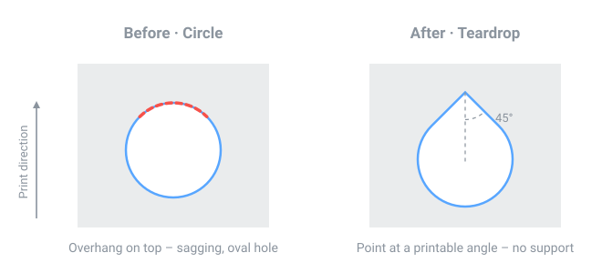

# Teardrop Hole – Fusion 360 Add-In

> English translation of [deffel6/TeardropHole](https://github.com/deffel6/TeardropHole), which is in German. All credit for the add-in goes to its original author.

## What is it for?

When you design a round hole in Fusion 360 that will later be printed **lying down** (the hole's axis points sideways, not up), the printer has a problem with the top part of the circle: the last layers have to bridge an increasingly large overhang with nothing underneath. The result is sagging strands, an oval instead of a round opening, or you need support material that you then have to painstakingly pick out afterwards.

The well-known fix for this is the **teardrop shape** (teardrop hole): you replace the top part of the circle with a point. Every wall then stays within the angle your printer can manage without support (usually 45°) – the rest of the hole stays a perfectly normal circle.

  

## What does the add-in do?

It adds a **"Teardrop Hole"** button to Fusion 360 (Solid tab → Modify panel). With it you select one or more round hole faces in the model, enter the allowed overhang angle (default: 45°), and the add-in automatically cuts the matching point into the top of the hole.

## Who is this for?

Anyone who designs in Fusion 360 and prints their parts on an FDM (filament) 3D printer – e.g. enclosures with screw holes in the side, cable pass-throughs or connectors. Holes whose axis points straight up during printing don't need any of this (they print fine as a circle anyway).

## Installation

1. Put the folder `TeardropHole 13` (with the `.py` and `.manifest` files) somewhere permanent (not in your Downloads folder, which tends to get cleaned up).
2. In Fusion 360: **Utilities → Add-Ins → Scripts and Add-Ins** (or Shift+S).
3. Use the **+** to select the folder.
4. Turn on the switch next to "TeardropHole" (and optionally tick "Run on Startup").
5. The "Teardrop Hole" button appears in the Solid tab, in the Modify panel.

**Important when updating an existing installation:** Fusion identifies the add-in by the `id`/`name` in the manifest (`"TeardropHole"`), not by the folder name – a new folder with a higher version number is still recognized as the same add-in, and the previously loaded Python code stays cached in the running Fusion process. So after adding a new version, **quit Fusion 360 completely and restart it** (don't just switch the add-in off and on again) so that the new code is actually loaded.

## Usage

1. Click the button.
2. Select one or more cylindrical hole faces.
3. Optional: click an edge that points "up" (the print direction) in your model – in case that isn't the default Z axis.
4. Enter the overhang angle (45° is a good default for most printers/materials).
5. Hole depth: at 0 the depth is detected automatically from the selected hole (works for through-holes and blind holes, including ones with a pointed bottom). If there's no hole there at all yet (just a reference face on solid material), enter the desired depth here manually.
6. Optional: tick "Keep cut-off piece (triangle) as a body" if you also want the small wedge-shaped piece that gets cut off at the top as its own body (e.g. to look at or reuse). The cut in the hole itself still happens as normal. In the "Clearance" field below it you can set how much smaller this separate body is made all around (default 0.1 mm), so that e.g. as a printed test plug it fits into the real hole with some play.
7. OK – done.

*Works for through-holes and blind holes with a cylindrical face that directly borders a flat wall face.*

## Version history

| Version | Changes |
|---|---|
| 2.4.0 | State before the clearance feature (folder `TeardropHole 11`). The cutout body is extruded directly from `profile_cap`, symmetrically (works, but by design a kept body sticks out a bit in both directions). |
| 2.5.0–2.5.3 | Attempts to add a "clearance" for the cutout body (folder `TeardropHole 12`, fixed iteratively directly in the code). A second, concentric sketch for the smaller shape confused the profile detection of the real cut (the part was split into two halves). An offset face on all faces of the finished body failed because Fusion requires an unchanged reference face. On top of that, the cutout body was extruded symmetrically over the full (doubled) cut depth and therefore stuck far out of the wall. |
| **2.6.0** | Clean rebuild in its own folder (`TeardropHole 13`), all three problems fixed: the cutout body is again created directly from `profile_cap` (as in 2.4.0), but extruded **one-sided** into the material (direction determined from the wall face normal) instead of symmetrically/doubled – no more sticking out. The clearance is done by **scaling** about the hole's center point instead of with a second sketch or an offset face – works reliably even with the pointed corner of the teardrop shape. |
| **2.6.1** | The scale point was created with `comp.constructionPoints.add()` – that fails with `RuntimeError 3: Environment is not supported` in documents without recorded design history (direct modeling mode). Attempted fix: pass the `center` point (a plain `Point3D`) directly to the scale function. |
| **2.6.2** | `ScaleFeatureInput` doesn't accept a raw `Point3D` as its base point (`RuntimeError 3: invalid ref point`) – it needs a real reference entity (vertex/sketch point). Attempted fix: create a sketch point in the already existing sketch and use that as the base point. |
| **2.6.3** | The new sketch point + the scaling ran BEFORE the real cut and invalidated `profile_circle`/`profile_cap` – the main cut failed completely ("invalid profile(s)", the hole stayed a plain circle without a point, even though the separate cutout body already looked right). Fix: changed the order – create the cutout body, **immediately** followed by the real cut (nothing in between, as in the proven v2.4.0 order), and the clearance scaling only at the very end, when the profiles are no longer needed. |

**Convention:** For bigger changes, create a new folder `TeardropHole <version>` (bump the file and manifest version together) and then restart Fusion 360, see the installation note above.
